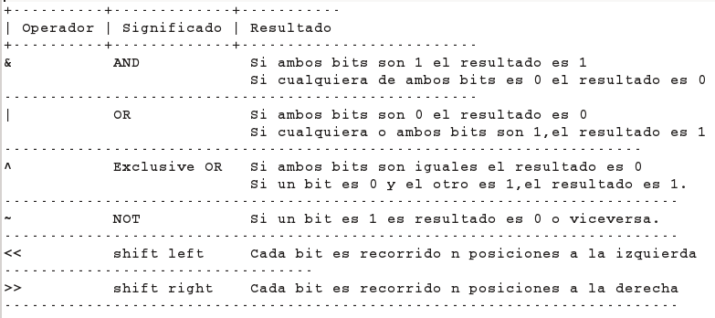
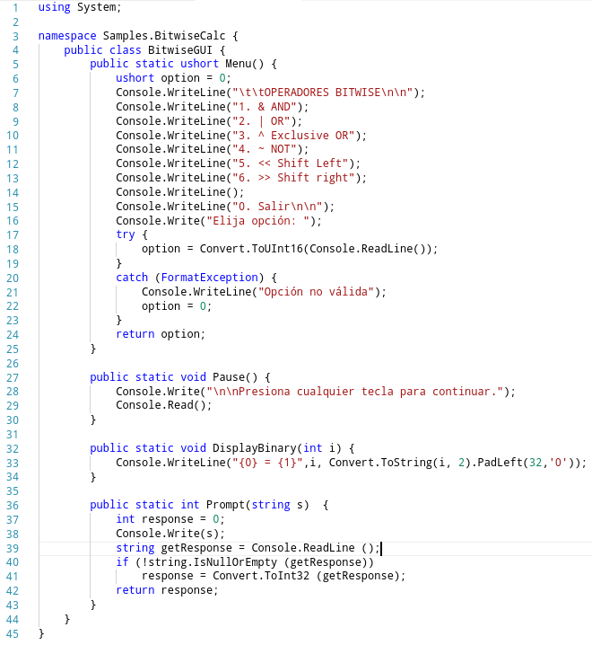
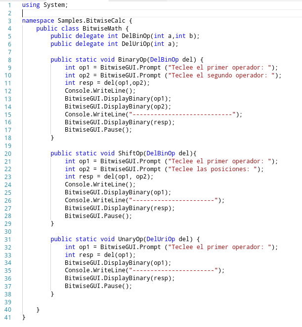
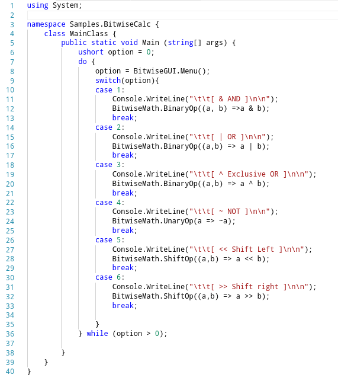
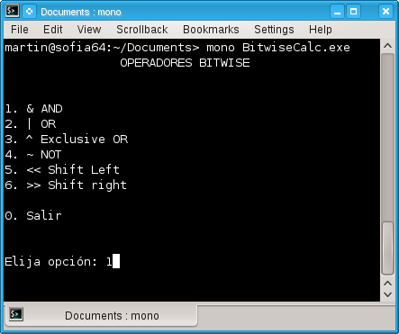
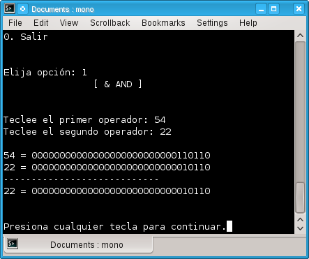
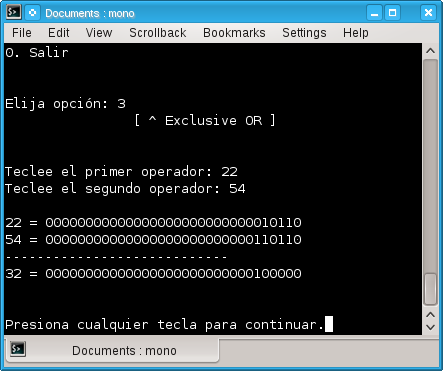
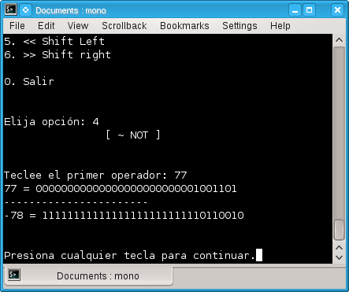
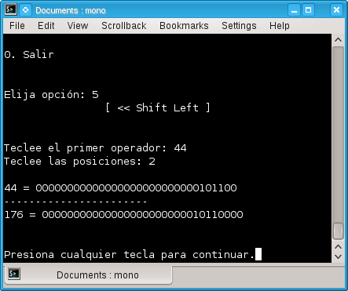

# Operadores a nivel de bits en C# (bitwise operators)

Además de los operadores condicionales lógicos y de relación C# cuenta con operadores a nivel de bits (bitwise operators o logical operators) que permiten realizar operaciones con las representaciones binarias de las variables que internamente utiliza la computadora, esto es útil en ciertos casos donde se requiere interactuar directamente con el hardware o utilizar una variable entera como un arreglo de bits donde por ejemplo un tipo short representaría un arreglo de bits con una longitud de 16 valores y cada bit podría ser utilizado como si fuera un valor booleano 1 igual true y 0 igual a false.

Los tipos de datos donde usualmente aplican estos operadores son: los numéricos y las enumeraciones.

La siguiente tabla muestra los tipos numéricos, su longitud en bytes y su valor en decimal.

Así por ejemplo si tenemos valores decimales representados en variables byte (8 bits hasta 255 en decimal)

<pre>
byte a = 22;
byte b = 33;
</pre>

Internamente su representación en binario es:

<pre>
22 = 00010110
33 = 00100001
</pre>

si utilizamos variables de tipo short (16 bits hasta 65,535)

<pre>
short c = 666;
short d = 6666;
</pre>

su representación en binario es:

<pre>
666 = 00000010 10011010
6666 = 00011010 00001010
</pre>

Así con cada tipo numérico siempre agrupando las cadenas de bits de 8 en 8.
La siguiente tabla muestra los operadores bitwise, su significado y su resultado.

A continuación un ejemplo de la utilización de estos operadores con enteros, este programa tiene 3 clases:

1.BitwiseGUI.class: Contiene el código para las interacciones del usuario con el programa, como el menú,la pausa y la impresión del resultado.

2.BitwiseMath.class: Contiene las operaciones unarias y binarias de los operadores.

3.MainClass.class: Es el programa principal en donde se evalua la opción ingresada por el usuario.

Al ejecutarlo veremos los siguientes resultados:

Otro uso común de estos operadores esta en las enumeraciones como en el caso de los valores de las enumeraciones FileMode y FileAccess del siguiente código.

<pre> 
FileStream outStream = new FileStream("log.txt",FileMode.Append | FileMode.Create,
FileAccess.Read | FileAccess.Write,FileShare.Read);
StreamWriter sw = new StreamWriter(outStream);
sw.WriteLine("Archivo de log");
sw.Close();
</pre>

